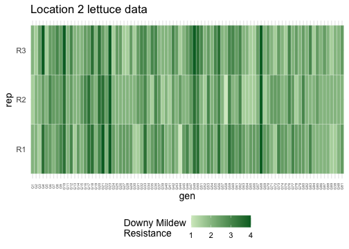

## Motivation

A key goal in any breeding trial is to calculate heritability, which describes the extent of which a trait of interest is underpinned by genetic variance. `heritable` is the one-stop shop for heritability calculations in R. Here, we have implemented existing methods for heritability to aid more reproducible and transparent reporting of it's calculations. This vignette is a brief overview of `heritable`'s workflow and key features.

`heritable` is compatible with model outputs from [`asreml`](https://vsni.co.uk/software/asreml-r/) and [`lme4`](https://cran.r-project.org/package=lme4) and extracts the relevant variance components to calculate heritability for **single environment trials.**

## Installation

Note that this package is under active development. You can install the development version of heritable from [GitHub](https://github.com/) with:


``` r
# install.packages("pak")
# pak::pak("anu-aagi/heritable")
library(heritable)
```

## A demo

Let's work with the `lettuce` dataset that contains phenotypic measurements of downy mildew resistance score of 89 lettuce genotypes across 3 locations (environments), with 3 replicates.For demonstration purposes, we will use a subset of single environment (`loc == L2`), which is displayed in the plot below.


``` r
library(dplyr)
head(lettuce_phenotypes)
#> # A tibble: 6 × 4
#>   loc   gen   rep       y
#>   <fct> <fct> <fct> <dbl>
#> 1 L1    G1    R1      2  
#> 2 L1    G1    R2      2.5
#> 3 L1    G2    R1      1.5
#> 4 L1    G2    R2      2  
#> 5 L1    G3    R1      1  
#> 6 L1    G3    R2      2

lettuce_subset <- lettuce_phenotypes |>
  filter(loc == "L2")
```



We also have access to a genomic relationship matrix (GRM) calculated from 300 genetic markers that we will use for narrow-sense heritability.


``` r
# View the structure of the GRM
dim(lettuce_GRM)
#> [1] 89 89
lettuce_GRM[1:5, 1:5]
#>     G1  G2  G3  G4  G5
#> G1 268   9  13  -3 -46
#> G2   9 270 -19 -50 104
#> G3  13 -19 250  21  -5
#> G4  -3 -50  21 281  21
#> G5 -46 104  -5  21 296
```

## Broad-sense heritability

Broad-sense heritability represents the ratio of genetic variance over phenotypic variance. Genetic variance here incorporates additive, epistatic and dominance effects.

Here, we have provided code for both `asreml` and `lme4` to fit a model with genotype as a random effect. **Note** that all heritability estimates should be the same as the data is balanced.


``` r
# Fit an asreml model with genotype as random effect
library(asreml)
lettuce_asreml <- asreml(
  fixed = y ~ rep,
  random = ~ gen,
  data = lettuce_subset,
  trace = FALSE
)

# Fit an lme4 model with genotype as random effect
library(lme4)
lettuce_lme4 <- lmer(y ~ rep + (1 | gen), data = lettuce_subset)
```

Use the `H2()` wrapper to compute **broad-sense heritability**.

The wrapper has three key imputs

- `model`, your `lme4` or `asreml` object
- `target`, the name of your genotype/varietal/line variable in your model e.g. `"gen"`
- `method`, which method of `H2` calculation do you want. By default, all methods are computed.


``` r
# Calculate broad-sense heritability using multiple methods
H2(lettuce_asreml, target = "gen", method = c("Standard", "Cullis", "Oakey"))
#> Error in eval(newcall, parent.frame()): object 'lettuce_subset' not found
H2(lettuce_lme4, target = "gen", method = c("Standard", "Cullis", "Oakey"))
#>  Standard    Cullis     Oakey 
#> 0.8294971 0.8294971 0.8294971
```

Alternatively if you want a single method, you can call each method's function directly. These are named with the `H2_` prefix, followed up the method name.


``` r
H2_Cullis(lettuce_asreml, target = "gen")
#> Error in eval(newcall, parent.frame()): object 'lettuce_subset' not found
H2_Delta(lettuce_lme4, target = "gen")
#> [1] 0.8294971
```

> Learn more about each method by looking up their help file `?H2_Cullis`

<!-- ## Narrow-sense heritability -->

<!-- Narrow-sense heritability is currently only implemented for **`asreml`** model object as there is no native workflow to fit a GRM using `lme4`. However it is possible using other extension packages such as [`lme4qtl`](http://dx.doi.org/10.1186/s12859-018-2057-x) and [`lme4breeding`](https://cran.r-project.org/web/packages/lme4breeding/lme4breeding.pdf) -->

<!-- In the following model, we will fit the `lettuce_GRM` genomic relationship matrix using `asreml::vm()` -->


<!-- ``` r -->
<!-- # Fit model with GRM for narrow-sense heritability -->
<!-- lettuce_asreml_grm <- asreml( -->
<!--   fixed = y ~ loc, -->
<!--   random = ~ vm(gen, lettuce_GRM) + rep, -->
<!--   data = lettuce_phenotypes, -->
<!--   trace = FALSE -->
<!-- ) -->
<!-- ``` -->

<!-- Similar to `H2()`, we can use the `h2()` wrapper to compute narrow-sense heritability. Remembering to specify: -->

<!-- - `model`, your `asreml` object -->
<!-- - `target`, the name of your genotype/varietal/line variable in your model e.g. `"gen"` -->
<!-- - `method`, which method of `h2()` calculation do you want. By default, the function will compute all available methods. Currently only `"Oakey"` and `"Delta"` are implemented for `h2()` -->


<!-- ``` r -->
<!-- # Calculate narrow-sense heritability -->
<!-- h2(lettuce_asreml_grm, target = "gen", method = "Oakey") -->
<!-- #> Error in UseMethod("h2"): no applicable method for 'h2' applied to an object of class "asreml" -->
<!-- ``` -->

<!-- Similarly, you can call the single method sub-functions using the prefix `h2_` followed by the method name. Here we are calculating pairwise heritability between every genotype. See `?h2_Delta_pairwise()` to learn more. -->


<!-- ``` r -->
<!-- h2_Delta(lettuce_asreml_grm, target = "gen", type = "BLUP") -->
<!-- #> Error in UseMethod("h2_Delta"): no applicable method for 'h2_Delta' applied to an object of class "asreml" -->
<!-- ``` -->

## Alternative output formats

Depending on which `heritable` function, the output will vary:

- `H2()` wrappers will return a named vector by `method`
- `H2_Delta()` will return a numeric value
- `H2_Delta_by_genotype()` will return a named list according to the `target` variable
- `H2_Delta_pairwise()` will return a symmetrical matrix for all pairwise combinations of `target`

If you interested in comparing heritability values across multiple models or methods, we can leverage `tidyverse` functions to wrangle the output as a dataframe/tibble


``` r
library(purrr)
library(tidyr)

tibble(
  model = list(lettuce_lme4, lettuce_asreml) # Include model as a list variable
  ) |>
  mutate(H2 = map(model, # Apply the `H2()` function over each model object
                  ~H2(.x, target = "gen", method = c("Standard", "Delta", "Oakey"))
                  )
         )|>
  unnest_wider(H2) # Expand the output
#> Error in `mutate()`:
#> ℹ In argument: `H2 = map(...)`.
#> Caused by error in `map()`:
#> ℹ In index: 2.
#> Caused by error:
#> ! object 'lettuce_subset' not found
```

