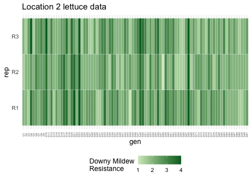

## Motivation

A key goal in any breeding trial is to calculate heritability, which describes the extent of which a trait of interest is underpinned by genetic variance. `heritable` is the one-stop shop for heritability calculations in R. Here, we have implemented existing methods for heritability to aid more reproducible and transparent reporting of it's calculations. This vignette is a brief overview of `heritable`'s workflow and key features.

`heritable` is compatible with model outputs from [`asreml`](https://vsni.co.uk/software/asreml-r/) and [`lme4`](https://cran.r-project.org/package=lme4), extracting relevant variance components from flexible mixed-model specifications to estimate heritability across **complex experimental designs** including including multi-environment trials.

## Installation

Note that this package is under active development. You can install the development version of heritable from [GitHub](https://github.com/) with:


``` r
# install.packages("pak")
# pak::pak("anu-aagi/heritable")
library(heritable)
```

## A demo

Let's work with the `lettuce` dataset that contains phenotypic measurements of downy mildew resistance score of 89 lettuce genotypes across 3 locations (environments), with 3 replicates.For demonstration purposes, we will use a subset of single environment (`loc == L2`), which is displayed in the plot below.


``` r
library(dplyr)
head(lettuce_phenotypes)
#> # A tibble: 6 × 4
#>   loc   gen   rep       y
#>   <fct> <fct> <fct> <dbl>
#> 1 L1    G1    R1      2  
#> 2 L1    G1    R2      2.5
#> 3 L1    G2    R1      1.5
#> 4 L1    G2    R2      2  
#> 5 L1    G3    R1      1  
#> 6 L1    G3    R2      2

lettuce_subset <- lettuce_phenotypes |>
  filter(loc == "L2")
```



We also have access to a genomic relationship matrix (GRM) calculated from 300 genetic markers that we will use for narrow-sense heritability.


``` r
# View the structure of the GRM
dim(lettuce_GRM)
#> [1] 89 89
lettuce_GRM[1:5, 1:5]
#>     G1  G2  G3  G4  G5
#> G1 268   9  13  -3 -46
#> G2   9 270 -19 -50 104
#> G3  13 -19 250  21  -5
#> G4  -3 -50  21 281  21
#> G5 -46 104  -5  21 296
```

## Broad-sense heritability

Broad-sense heritability represents the ratio of genetic variance over phenotypic variance. Genetic variance here incorporates additive, epistatic and dominance effects.

Here, we have provided code for both `asreml` and `lme4` to fit a model with genotype as a random effect. **Note** that all heritability estimates should be the same as the data is balanced.


``` r
# Fit an asreml model with genotype as random effect
library(asreml)
lettuce_asreml <- asreml(
  fixed = y ~ rep,
  random = ~ gen,
  data = lettuce_subset,
  trace = FALSE
)

# Fit an lme4 model with genotype as random effect
library(lme4)
lettuce_lme4 <- lmer(y ~ rep + (1 | gen), data = lettuce_subset)
```

Use the `H2()` wrapper to compute **broad-sense heritability**.

The wrapper has three key inputs

- `model`, your `lme4` or `asreml` object
- `target`, the name of your genotype/varietal/line variable in your model e.g. `"gen"`
- `method`, which method of `H2` calculation do you want. By default, all methods are computed.


``` r
# Calculate broad-sense heritability using multiple methods
H2(lettuce_asreml, target = "gen", method = c("Standard", "Cullis", "Oakey"))
#>  Standard    Cullis     Oakey 
#> 0.8294971 0.8294971 0.8294971
H2(lettuce_lme4, target = "gen", method = c("Standard", "Cullis", "Oakey"))
#>  Standard    Cullis     Oakey 
#> 0.8294971 0.8294971 0.8294971
```

Alternatively if you want a single method, you can call each method's function directly. These are named with the `H2_` prefix, followed up the method name.


``` r
H2_Cullis(lettuce_asreml, target = "gen")
#> [1] 0.8294971
H2_Delta(lettuce_lme4, target = "gen")
#> [1] 0.8294971
```

> Learn more about each method by looking up their help file `?H2_Cullis`

## Narrow-sense heritability

Narrow-sense heritability is currently only implemented for **`asreml`** model object as there is no native workflow to fit a GRM using `lme4`. However it is possible using other extension packages such as [`lme4qtl`](https://dx.doi.org/10.1186/s12859-018-2057-x) and [`lme4breeding`](https://CRAN.R-project.org/package=lme4breeding)

In the following model, we will fit the `lettuce_GRM` genomic relationship matrix (GRM) using `asreml::vm()`


``` r
# Fit model with GRM for narrow-sense heritability
lettuce_asreml_grm <- asreml(
  fixed = y ~ rep,
  random = ~ vm(gen, source = lettuce_GRM),
  data = lettuce_subset,
  trace = FALSE
)
```

Similar to `H2()`, we can use the `h2()` wrapper to compute narrow-sense heritability. Remembering to specify:

- `model`, your `asreml` object
- `target`, the name of your genotype/varietal/line variable in your model e.g. `"gen"`
- `method`, which method of `h2()` calculation do you want. By default, the function will compute all available methods. Currently only `"Oakey"` and `"Delta"` are implemented for `h2()`.

An additional `source` argument is required to provide `h2()` with the genetic covariance structure used for model fitting. If this argument is not supplied, the function will attempt to locate the covariance structure in the global environment. Since we specified the structure using the GRM `lettuce_GRM`, we provide it explicitly to `h2()`.

``` r
# Calculate narrow-sense heritability
h2(lettuce_asreml_grm, target = "gen", method = c("Standard", "Cullis", "Oakey"),
 source = list(lettuce_GRM = lettuce_GRM))
#>  Standard    Cullis     Oakey 
#> 0.8242839 0.8759621 0.5857853
```

Similarly, you can call the single method sub-functions using the prefix `h2_` followed by the method name. Here we are calculating pairwise heritability between every genotype. See `?h2_Delta_pairwise()` to learn more.


``` r
h2_Delta(lettuce_asreml_grm, target = "gen", type = "BLUP",
 source = list(lettuce_GRM = lettuce_GRM))
#> [1] 0.8751257
```

## Alternative output formats

Depending on which `heritable` function, the output will vary:

- `H2()` wrappers will return a named vector by `method`
- `H2_Delta()` will return a numeric value
- `H2_Delta_by_genotype()` will return a named list according to the `target` variable
- `H2_Delta_pairwise()` will return a symmetrical matrix for all pairwise combinations of `target`

If you interested in comparing heritability values across multiple models or methods, we can leverage `tidyverse` functions to wrangle the output as a dataframe/tibble


``` r
library(purrr)
library(tidyr)

tibble(
  model = list(lettuce_lme4, lettuce_asreml) # Include model as a list variable
  ) |>
  mutate(H2 = map(model, # Apply the `H2()` function over each model object
                  ~H2(.x, target = "gen", method = c("Standard", "Delta", "Oakey"))
                  )
         )|>
  unnest_wider(H2) # Expand the output
#> # A tibble: 2 × 4
#>   model     Standard Delta Oakey
#>   <list>       <dbl> <dbl> <dbl>
#> 1 <lmerMod>    0.829 0.829 0.829
#> 2 <asreml>     0.829 0.829 0.829
```


## Heritability in multi-environment trials

Starting with version 0.2.0, `heritable` supports heritability estimation from flexibly specified mixed models, extending beyond single-environment trials. In this section, we demonstrate heritability estimation for a multi-environment trial using a genotype-by-environment (G×E) model.

When a model contains a G×E interaction, the definition of heritability become ambiguous as each interaction term  can either be treated as nuisance variation or genetic variation specific to the corresponding environment. We illustrate how we address this ambiguity by showing the calculation of three heritability definitions: 

* **Conventional heritability**, which is based only on the genotype main effect and treats G×E variation as nuisance variation.

* **Marginal heritability**, which defines the effect of a genotype as the combination of its main effect and its G×E effects averaged across environments. Heritability is then calculated with respect to this marginalised genotype effect and can therefore be interpreted as a global measure of the reliability of average genotype performance across environments.

* **Stratified heritability**, which defines the effect of a genotype within a particular environment as the combination of its main effect and its G×E effect in that environment. It therefore measures the reliability of genotype performance within a specified environment.

We first fit an `lme4` model to the complete lettuce dataset without subsetting to a single environment:

```r
lettuce_lme4_gxe <- lmer(
  y ~ rep + (1 | gen * loc),
  data = lettuce_phenotypes
)
```

The random-effects expression `(1 | gen * loc)` expands to random effects for genotype, location, and their interaction:

```r
(1 | gen) + (1 | loc) + (1 | gen:loc)
```

Again, we call `H2()` (or `h2()` for narrow-sense) on the fitted model object. For multi-environment models, the following arguments control which definition of heritability is calculated:

- `marginal`: a logical specifies whether marginal heritability should be calculated.

- `stratification`: a one-row data frame specifies the environmental stratum, or combination of strata, within which heritability should be estimated.

When `stratification` is not supplied, the `marginal` argument determines whether conventional or marginal heritability is returned. 
```r
# Conventional heritability
H2(lettuce_lme4_gxe, target = "gen", marginal = FALSE)
#>    Cullis     Oakey    Piepho     Delta  Standard 
#> 0.7818483 0.7818483 0.7806165 0.7818483 0.7732908 

# Marginal heritability
H2(lettuce_lme4_gxe, target = "gen", marginal = TRUE)
#>    Cullis     Oakey    Piepho     Delta  Standard 
#> 0.8918420 0.8816507 0.8895969 0.8918420 0.8895969 
```

When `stratification` is supplied, stratified heritability is calculated for the specified environmental conditions. For example, heritability within location `L1` is calculated as follows:

```r
H2(lettuce_lme4_gxe, target = "gen", stratification = data.frame(loc = "L1"))
#>    Cullis     Oakey    Piepho     Delta  Standard 
#> 0.7870175 0.7780589 0.7250292 0.7870175 0.7250292 
```

## Confidence intervals
To compute confidence intervals, first store the output from `H2()` or `h2()`. A `heritable` object retains the fitted model and the arguments used in the original heritability calculation, allowing the calculation to be repeated for each parametric-bootstrap sample.

```r
estimate <- H2(lettuce_lme4, target = "gen", method = c("Cullis", "Standard"))
confint(estimate, B = 100, seed = 2026)
#>              2.5 %    97.5 %
#> Cullis   0.7792096 0.9395049
#> Standard 0.7792096 0.9395049
```

Here, `B` specifies the number of bootstrap replicates. A larger value of `B` generally provides more stable confidence intervals but requires additional computation.

Parametric bootstrap is computationally intensive because each bootstrap replicate involves three main steps:

1. simulating a new response from the fitted mixed model;
2. refitting the model to the simulated data; and
3. extracting the variance components and recalculating heritability.

The computational cost can therefore become substantial for large or complex models, particularly when a large number of bootstrap replicates is requested. `heritable` provides two ways to accelerate this calculation.

### Parallel computation

The first approach is to distribute the bootstrap replicates across multiple workers. The `parallel`, `ncpus`, and `cl` arguments are passed to the underlying bootstrap routine; see `?boot::boot` for further details.

As a general rule of thumb, use `parallel = "multicore"` on non-Windows systems and `parallel = "snow"` on Windows. The `ncpus` argument specifies the number of workers.

For example, the following code distributes 100 bootstrap replicates across five workers:

```r
confint(estimate, B = 100, parallel = "snow",ncpus = 5)
#>              2.5 %    97.5 %
#> Cullis   0.7731271 0.8911410
#> Standard 0.7731271 0.8911410
```

With five workers, each worker performs approximately `B / 5` bootstrap replicates, although the exact allocation may vary.

On a non-Windows system, the corresponding call is:

```r
# Not run
confint(estimate, B = 100, seed = 2026, parallel = "multicore",ncpus = 5)
```

For more control over a snow cluster, a cluster object can be created explicitly and supplied through `cl`:

```r
# Not run
cl <- parallel::makeCluster(5)
confint(estimate, B = 100, seed = 2026, parallel = "snow", cl = cl)
parallel::stopCluster(cl)
```

When using `asreml`, the number of parallel workers must not exceed the number of available `asreml` licences.

### Algorithmic acceleration

The second approach reduces computational cost through algorithmic acceleration, but may be less numerically stable. It does so by:

1. approximating required matrix pseudoinverses using ridge penalties rather than exact positive-semidefinite matrix inversion; and
2. calculating prediction- and estimation-error variance matrices by solving mixed-model equations rather than deriving them through direct inversion of marginal response covariance matrices.

To use this approach, set the global option `exact_psd_inv` to `FALSE` and pass `solver = "LMM"` to `H2()` or `h2()`:

```r
# Default, numerically stable computation
default_time <- system.time({
  estimate_default <- H2(
    lettuce_lme4,
    target = "gen",
    method = c("Cullis", "Standard")
  )

  ci_default <- confint(
    estimate_default,
    B = 100,
    seed = 2026
  )
})

# Accelerated, approximate computation
previous_exact_psd_inv <- getOption("exact_psd_inv")
options(exact_psd_inv = FALSE)

fast_time <- system.time({
  estimate_fast <- H2(
    lettuce_lme4,
    target = "gen",
    method = c("Cullis", "Standard"),
    solver = "LMM"
  )

  ci_fast <- confint(
    estimate_fast,
    B = 100,
    seed = 2026
  )
})

# Restore the previous option
options(exact_psd_inv = previous_exact_psd_inv)

default_time - fast_time
#> user  system elapsed 
#> 0.97    0.07    0.78 
```

For small models, the difference in runtime may be modest. The improvement generally becomes more apparent as the number of observations, random effects, environments, or bootstrap replicates increases. However, algorithmic acceleration may produce less numerically stable results than the default calculation.

Parallel computing and algorithmic acceleration can also be used together.

## Interested in complex models?

Finally, we emphasise that `heritable` is designed to work with complex mixed models specified by the user. This includes, for example, deeply nested `lme4` models:

```r
# Not run: this model was fitted to confidential data that are not
# included in the vignette and is shown for demonstration only.
lme4::lmer(
  y ~ Type * Treatment * Stage +
    (1 | Genotype) +
    (Stage | Genotype / Treatment) +
    (1 | Date) +
    (1 | Plot / Replicate),
  data = df
) |>
  heritable::H2(target = "Genotype")

#>    Cullis     Oakey    Piepho     Delta  Standard
#> 0.5793787 0.5969357 0.4619369 0.5793787 0.4592437
```

It also supports `asreml` models with structured residual variation, including spatial residual models:

```r
# Not run: this model was fitted to confidential data that are not
# included in the vignette and is shown for demonstration only.
asreml::asreml(
  fixed = y ~ 1,
  random = ~ Line + Range + Row + RowRep:ColRep,
  residual = ~ ar1(Range):ar1(Row),
  data = df
) |>
  heritable::H2(target = "Line")

#>    Cullis     Oakey    Piepho     Delta  Standard
#> 0.9545024 0.9545024 0.9544771 0.9545024 0.9518358
```

To work with an `asreml` model object, `heritable` must parse the variance-modeling special functions used in the model formula and reconstruct covariance matrices from the estimated variance parameters.

The package currently supports several commonly used structures, including `vm()` and `ar1()`. However, `asreml` provides many additional variance structures and combinations that may appear in more complex models.

We welcome community contributions that extend support for additional `asreml` variance structures. See GitHub issue [#51](https://github.com/anu-aagi/heritable/issues/51) for details.


